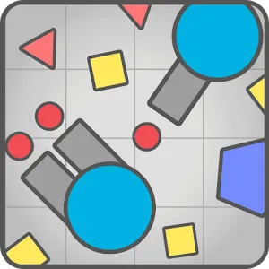

= tanks.io

*Mechanics*:    Controls tank, that shoots other players and
                shapes. By destroying players or shapes player gets
                points, and then upgrade tank. +
*Genre*:        Shooter +
*Platform*:     Web, Mobile, PC +
*Monetization*: None +
*Audience*:     Clients, who play in http://agar.io/[Agar.io],
                http://diep.io/[Diep.io] and other `.io` games. +

[[graphics]]
=== Graphics

- triangles
- squares
- pentagon
- hexagons
- circles

[NOTE]
Every shape in tanks.io has border. Border is always
+++<code style="color: #FFF; background: #555555">dark grey (#555555)+++

[[music]]
=== Music

No music.

[NOTE]
Enter nickname and then start.

[[game-field]]
=== Game field

Game field is grid.

[[tanks]]
=== Tanks

Tank consists from:

1. *body* - circle.
2. *guns* - +++<code style="color: #FFF; background: #999999">light grey (#999999)</code>+++
   rectangles.
3. *turret* (_optional_) - small
   +++<code style="color: #FFF; background: #999999">light grey (#999999)</code>+++
   circle.

[[levels]]
==== Levels

Each player has its score in every gamemode. Score can be earned for
destroying shapes and other players.

[[guns]]
==== Guns

- Simple guns
- Machine guns

[[controls]]
==== Controls

'WASD' keys.
Rotates towards mouse point.
